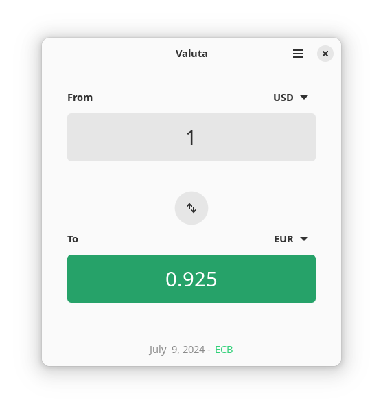

# Valuta

Convert currencies with ease. Valuta provides an intuitive and fast experience for your conversion needs.



## Providers
- [European Central Bank conversion provider through the API (Frankfurter).](https://www.frankfurter.app/)
- [Google finance conversion provider.](https://google.com)
- [Moeda.info conversion provider.](https://moeda.info/)

## Features
- Gnome search provider integration: example "10" or "10 USD to EUR".

## Flathub
<a href='https://flathub.org/apps/io.github.idevecore.Valuta'></a>

## Building

###  Requirements
- Python 3 `python` 
- PyGObject `python-gobject` 
- GTK4 `gtk4` 
- libadwaita (>= 1.2.0) `libadwaita`
- Meson `meson` 
- Ninja `ninja` 
- D-Bus `python-dbus`

### Building from Git
```bash 
 git clone --recurse-submodules https://github.com/idevecore/valuta.git
 cd valuta
 meson builddir --prefix=/usr/local 
 sudo ninja -C builddir install
 ```

## Translations

[](https://hosted.weblate.org/engage/currency-converter/)

Valuta has been translated into the following languages:

<a href="https://hosted.weblate.org/engage/currency-converter/">

</a>

Please help translate Valuta into more languages through [Weblate](https://hosted.weblate.org/engage/currency-converter/).


## Donate
If you like this project and have some spare money left, consider donating:

### Github Sponsors
<a href='https://github.com/sponsors/ideveCore'></a>

## Code of Conduct
The project follows the [GNOME Code of Conduct](https://conduct.gnome.org/).

## License 
 [GNU General Public License 3 or later](https://www.gnu.org/licenses/gpl-3.0.en.html)
